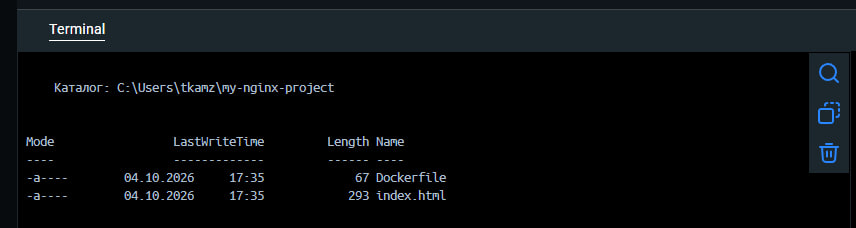
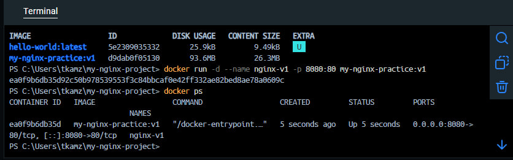
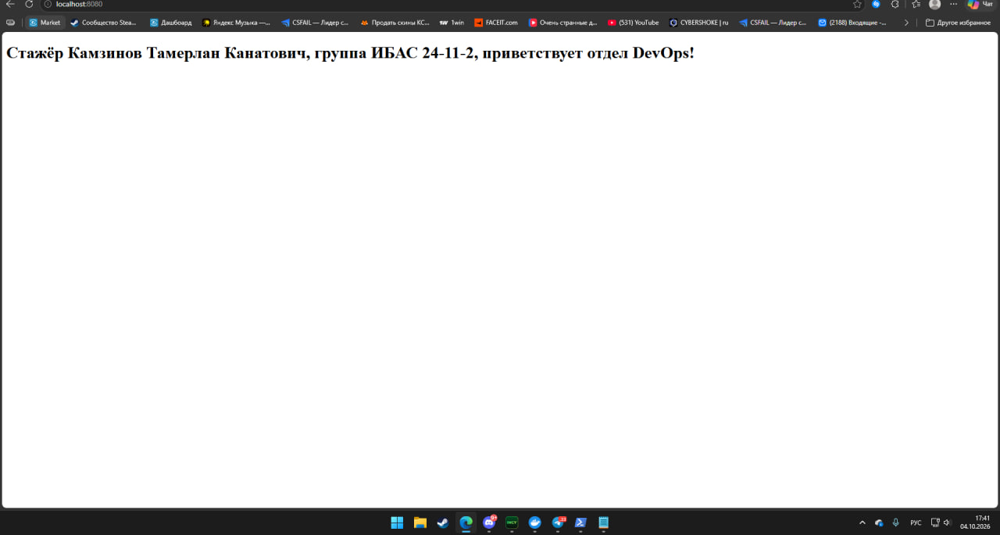
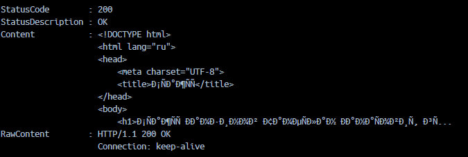
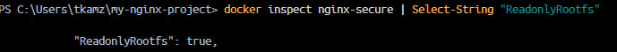
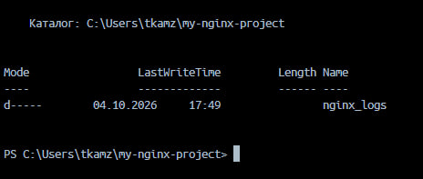
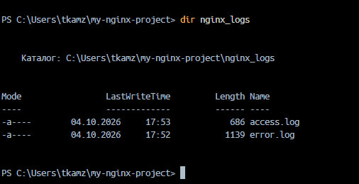
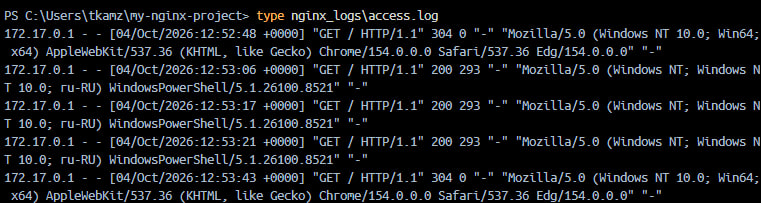

# Docker practice — Уровень 1 (Базовый)


**Выполнил:** Камзинов Тамерлан Канатович  

**Группа:** ИБАС 24-11-2  

**Тема:** Контейнеризация веб-сервера Nginx с ограничениями безопасности


---


## 📁 Описание файлов проекта


| Файл / папка | Что делает |

|--------------|------------|

| `Dockerfile` | Инструкция для сборки Docker-образа на базе `nginx:alpine`. Копирует кастомную HTML-страницу в `/usr/share/nginx/html/`. |

| `index.html` | Кастомная HTML-страница с приветствием от стажёра. Отдаётся Nginx при обращении к сайту. |

| `nginx\_logs/` | Папка на хосте, куда через volume монтируются логи Nginx (`access.log`, `error.log`). Нужна, потому что контейнер запущен с `--read-only`. |

| `nginx\_logs/access.log` | Лог всех HTTP-запросов к серверу. |

| `nginx\_logs/error.log` | Лог ошибок и служебных сообщений Nginx. |

| `screenshots/` | Скриншоты проверки работоспособности. |

| `README.md` | Этот файл. |


---


## 🛠️ Команды для запуска и проверки


### 1. Сборка образа


```bash

docker build -t my-nginx-practice:v1 .

docker images

```





### 2. Запуск контейнера с ограничениями


```bash

docker run -d --name nginx-logs -p 8080:80 --memory="50m" --cpus="0.5" --read-only --tmpfs /var/cache/nginx --tmpfs /var/run --tmpfs /tmp -v %cd%\\nginx\_logs:/var/log/nginx my-nginx-practice:v1

```


**Что делают флаги:\*\*

- `-d` — запуск в фоне

- `-p 8080:80` — порт 8080 на хосте → 80 в контейнере

- `--memory="50m"` — лимит RAM 50 МБ

- `--cpus="0.5"` — лимит CPU 0.5 ядра

- `--read-only` — корневая ФС только для чтения

- `--tmpfs ...` — временные папки Nginx в RAM

- `-v %cd%\\nginx\_logs:/var/log/nginx` — логи на хост


### 3. Проверка работоспособности


**Контейнер запущен:**

```bash

docker ps

```





**Сайт открывается:** http://localhost:8080





**Запросы через curl:**

```bash

curl.exe http://localhost:8080

```





**Read-only включён:**

```bash

docker inspect nginx-logs | Select-String "ReadonlyRootfs"

```





**Логи на хосте:**

```bash

dir nginx\_logs

type nginx\_logs\\access.log

```









---


## 🎯 Что демонстрирует проект


1. **Докеризация Nginx** — образ на базе `nginx:alpine` (~26 МБ).

2. **Ограничение ресурсов** — 50 МБ RAM, 0.5 CPU.

3. **Безопасность** — корневая ФС read-only.

4. **Volume для логов** — логи сохраняются на хосте.

